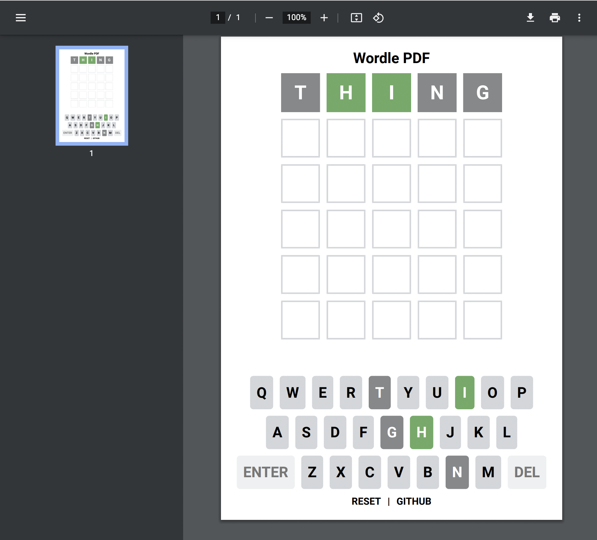

# [wordlepdf.com](https://wordlepdf.com)

Love [WORDLE](https://www.nytimes.com/2022/01/03/technology/wordle-word-game-creator.html) _and_ PDFs?

Well this is the project for you!



Built with:

1. [`@react-pdf/renderer`](https://react-pdf.org/)
2. React
3. Remix (mostly to manage deploying the custom PDF route)

## Background

### Motivation

No comment.

### Some findings from the original [Wordle](https://www.powerlanguage.co.uk/wordle/) source code

Here are some things about Wordle accurate at the time of this writing:

1. the game is entirely client side with only 127 kB of zipped HTML/CSS/JS with 59 kB of that being for gtm
2. all 2,315 words are in the client bundle and will appear in order (don't look at words.ts if you don't want spoilers)
3. after all words are used, it will loop.

The "Wordle Number" is generated relative to a hardcoded date in the Wordle source code and this Wordle number is used as an index in a list of possible words.

```js
import { words } from './words';

// this date is hardcoded in the Wordle sorce code
const epoch = new Date(2021, 5, 19, 0, 0, 0, 0);

/**
 * Given a date, returns the wordle number. This will correspond to the Wordle
 * number shared on socials. e.g "Wordle 210" etc
 */
function getWordleNumber(date: Date) {
  const delta =
    new Date(date).setHours(0, 0, 0, 0) - epoch.setHours(0, 0, 0, 0);
  const oneDay = 1000 * 60 * 60 * 24;

  return Math.round(delta / oneDay);
}

/**
 * Gets the solution for the given day
 */
export function getSolution(date: Date) {
  return words[getWordleNumber(date) % words.length];
}
```

## Features

Key features:

- you can print it!
- iT's eXtRa sLoW!!
- sharing on Twitter?
- press back to undo

Supported:

- the on-screen keyboard
- winning
- losing

Not supported:

- interactive typing (it's a PDF)
- animations (it's a PDF!)
- stats (no local storage state)
- countdown timer
